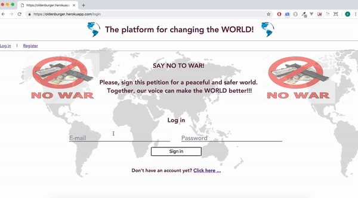

# Petition

## Summary

An online petition where supporters can register, log in, update profile information, provide their signature, redo their signature, and view a list of fellow supporters, those who signed thus far and sorted by location. The site also provides user security by using bcyrpt to protect users passwords. The theme of this petition is "Stop war around the world". 

## Tech used:
jQuery, Handlebars, Node.js, Express.js and PostgreSQL

## Features

The application has a user registration form, a login form and a logout option.
Users can add some personal information such as age, city and a personal web page.

Through the use of a canvas box the user can draw his/her signature to sign the petition users who signed the petition can see a list of all the other users that have previously signed.

Additionally, users can view other signatories based on their city users can edit their personal information (city,age,homepage) through to a dedicated edit-profile page users can also delete their signature from the petition

https://oldenburger.herokuapp.com/login

